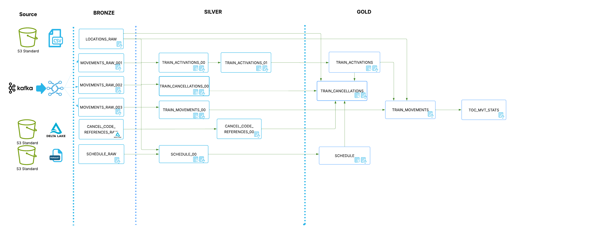

<H1 style="background-color: #28b6e9; padding: 10px; color: white;"> AR308: Hands-on Data Engineering with Snowflake in an Open Architecture </H1>

<h2 style="background-color: #28b6e9;">Presenters<h2>

For this lab we will be working with Data From the Open Rail Uk and we will have a data flow like the following:

## Lab Execution Sequence

To successfully complete this lab, please follow the steps below in order:

1. **Import and Execute the Bronze Notebook:**  
   Start by importing the `HOL_BRONZE_PIPELINE.ipynb` notebook into the Snowflake Notebook UI and execute all cells to set up the Bronze (raw ingestion) layer.

2. **Run Kafka Data Ingestion via Openflow:**  
   Follow the instructions in the `bronze/openflow` folder to run the Kafka data ingestion pipeline. This will ingest streaming data into your Snowflake Iceberg tables.

3. **Execute the Silver Notebook:**  
   Import the `HOL_SILVER_PIPELINE.ipynb` notebook into the Snowflake Notebook UI, making sure to use the `SILVER` schema, and execute all cells to transform and curate the data.

4. **Execute the Gold Notebook:**  
   Import the `HOL_GOLD_PIPELINE.ipynb` notebook into the Snowflake Notebook UI, using the `GOLD` schema, and execute all cells to create analytics-ready tables and views.

5. **Query Iceberg Tables with PySpark:**  
   Once all the above steps are complete, return to GitHub and use GitHub Codespaces to open and run the `pyspark_openCatalog_dashboard.ipynb` notebook. This notebook demonstrates how to query your Snowflake Iceberg tables using PySpark.

By following this sequence, you will experience the full end-to-end workflow of ingesting, transforming, and analyzing data in an open lakehouse architecture with Snowflake and Iceberg.
