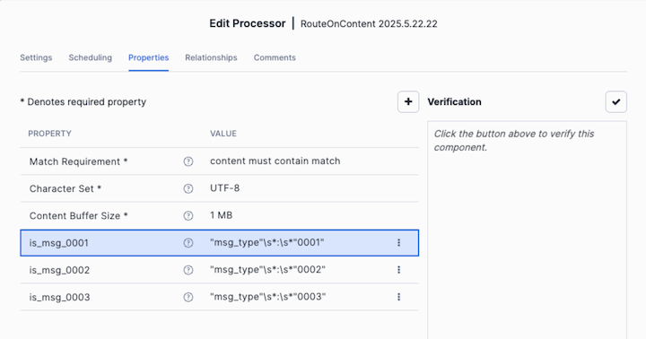

# Leveraging OpenFlow for Bronze Data Ingestion

We will be levering OpenFlow to ingest data from Kafka. Data is coming from the
[NetworkRail](https://www.networkrail.co.uk/who-we-are/transparency-and-ethics/transparency/open-data-feeds/) Open Data Feeds.

The target flow we will build will look like this:

This flow consumes the data from Kafka and then routes to different tables depending on the data.

Let's walk on the steps to get this flow built in openflow.

First let's navigate to the openflow canvas, and create a process group. Let's create it with a given name and remember to setup a parameter context. We will use that later.

We will get inside the process group. Just double click to get inside, and we will start by adding a
[ConsumeKafka](https://docs.snowflake.com/user-guide/data-integration/openflow/processors/consumekafka)
component.

To add it just drag the component into the canvas.

Before we use this component we need to configure it. So there are some settings to setup. Right click the component and select **Configure**:

We need to setup:

* Kafka Connection Service
* Group ID set this to your given group_id
* Topics set this to **trust**

Setting up the "Kafka Connection Service"

We will use the "three-dot" menu. Click on it, and select the "Create new service" option

This will open a dialog for you to select the service. Look for the

[Kafka3ConnectionService](https://docs.snowflake.com/en/user-guide/data-integration/openflow/controllers/kafka3connectionservice)

After adding it we need to configure the service, click on the three dots and select go to service:

Use the "three dot" menu again.

Set up the bootstrap server with the BROKER url.

It is a good practice to verify your settings. Click on the check button and follow the dialogs.

If everything is fine it will look like this:

Before we continue, let's test that everything is fine. To do that lets do the following, we will drag a log attribute and we will connect our ConsumeKafka component to it. And then we will right click and select Start

After a few seconds you should see that the queue starts to grow

\

Right click and select List queue

You will be taken to an screen like this:

You can use this screen to see the "flow files" and their properties. You can also examine the flow files contents. In you select view content and set the view to json , you can view your message like this:

Now let's stop our ConsumeKafka again and remove the LogAttribute and resume our flow.

And let continue with the rest of our Lab.

So the next thing we want to do is to be able to write to different tables depending on the Kafka message.

We will drag a RouteOnContent component to our canvas. And will select Configure as before. In the configure dialog we will use the + button to add new properties:

And we will add three properties:

| property name | Value                   |
| ------------- | ----------------------- |
| is_msg_0001   | "msg_type"\s*:\s*"0001" |
| is_msg_0002   | "msg_type"\s*:\s*"0002" |
| is_msg_0003   | "msg_type"\s*:\s*"0003" |

Also remember to set the Match Requirement

We will use in this case some regular expressions that will allows to know which messages have a particular message type.

Ok we are done with the routing.

Now we need to send these flow files to our target tables: MOVEMENTS_RAW_0001, MOVEMENTS_RAW_0002, MOVEMENTS_RAW_0003

Let's drag a new processor into our canvas. Now we will be adding a PutSnowpipeStreaming processor.

This component can be used to send data into tables in snowflake. We will need to configure:

* Connection settings: We need an user/private key/account/database/schema/table_name

  * For the private key we will need to setup a [private key service](https://docs.snowflake.com/en/user-guide/data-integration/openflow/controllers/standardprivatekeyservice)
* Record Reader

  * We need a [JsonTreeReader](https://docs.snowflake.com/en/user-guide/data-integration/openflow/controllers/jsontreereader)

# Setting up the private key service.

Just as before, we can use the "three dot" menu to create a service (select it looking for StandardPrivateKeyService) and then configure it.

Before that we need to upload our private key.

To do that we will go to the parameter context and select the one for our processor group. We will then add a parameter with a name according to our process group, check the reference assets checkbox, use the upload button to upload our private key, and save it.

We can now go to configure our Private Key Service

# Setting up the JsonTreeReader

For this service we just need to create a new one. Default settings will be enough for us.

Now we are ready to connect our tables. Drag from the RouteOnContent component to the PutSnowpipeComponent. You will see that a dialog with the properties we defined previously appears:

And you need to setup the relationships for the write node.

Now you are done for `MOVEMENTS_RAW_0001`. Just copy paste the now two times modify the processor name and table for `MOVEMENTS_RAW_0002` and `MOVEMENTS_RAW_0003` and drag the connections for `is_msg_0002` and `is_msg_0003`

And set the terminate relationship  for `RouteOnContent`

With that your flow should look like this:

And you can just start all nodes. You can go to your account and validate that data is flowing in the raw tables.
